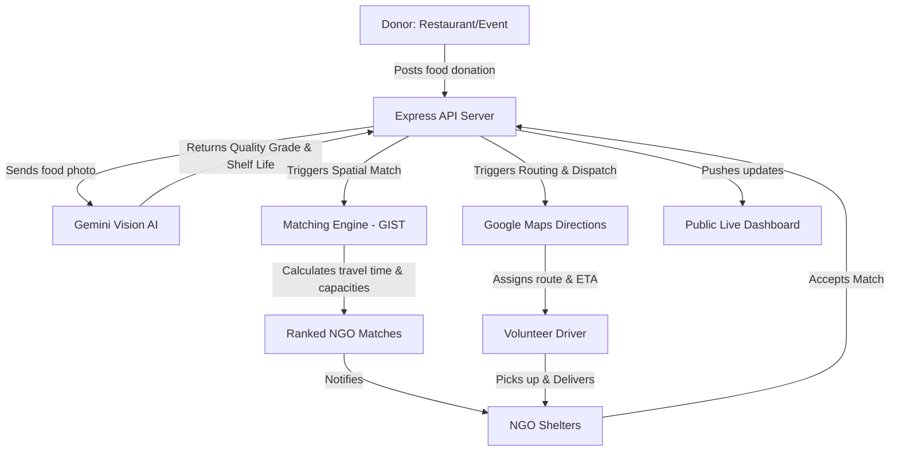
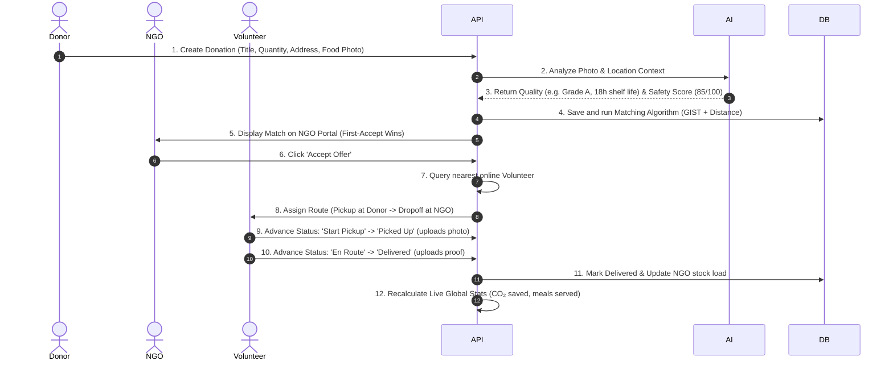

# FoodBridge Platform Blueprint & User Flow

This document details the architecture, end-to-end user flows, and page-by-page breakdown of the FoodBridge website.

---

## 1. Complete Architecture & Working Plan

FoodBridge is designed as an AI-powered logistics bridge between surplus food donors, local non-governmental organizations (NGOs), and delivery volunteers.

### Key Technical Pillars:
*   **Frontend**: Next.js 14 App Router styled with Tailwind CSS, utilizing Radix UI components (shadcn/ui).
*   **Backend**: Express API server running on Node.js.
*   **Database**: PostgreSQL hosted on Supabase, managed via Prisma ORM.
*   **Real-time & Background**: 
    *   Socket.io for live volunteer tracking.
    *   `node-cron` running background checks for expired donations.
*   **AI Integrations**:
    *   **Gemini Vision** (`gemini-1.5-flash` or similar) reviews uploaded images to assess food quality (Grade A/B/C/Unsafe), estimate shelf life, and flag concerns (mold, discoloration).
    *   **Gemini Text** (`gemini-1.5-flash`) predicts future surplus quantities for donor planning.
*   **Logistics & Mapping**: Custom spatial search to find nearby NGOs, and Google Maps Directions API to compute real-time travel times, distance, and transit routing.

---

## 2. End-to-End User Interaction Flow

Here is how the 3 key user personas interact with the system throughout a single food donation life cycle:

---

## 3. Role of Every Single Page & Tab

### Main Web Interface
*   **Landing Page (`/`)**: Displays the value proposition of the project (SDG 2 - Zero Hunger, SDG 12 - Responsible Consumption). Features quick calls-to-action: "Sign In", "Get Started", "Donate Food", "Register as NGO", and "Live Dashboard".
*   **Sign In (`/sign-in`)**: Secure gateway verifying user credentials via Supabase Auth and retrieving their profile database profile.
*   **Sign Up (`/sign-up`)**: Registers users. Dynamically selects forms based on the role requested:
    *   *Donors* and *NGOs* provide organization name and location coordinates.
    *   *Volunteers* specify vehicle type (bike, car, cycle, walking).

### The Main Dashboard (Tabs & Views)
*   **Overview Tab (`/dashboard`)**: The main admin/metrics interface. Displays aggregate numbers (Total Donations, AI Assessments, Active NGO accounts, and ongoing Deliveries) alongside quick action cards directing to other hub pages.
*   **Donations Tab (`/dashboard/donations`)**: Displays the global list of all donations on the platform with colored status badges (e.g., *Pending*, *AI Processing*, *Matched*, *In Transit*, *Delivered*). Shows individual item weight, quality grade, and expiry time.
*   **AI Assessment Hub (`/dashboard/ai`)**: Interactive AI testing suite split into three sections:
    1.  *Food Quality Assessment*: Upload an image URL/storage path to trigger Gemini Vision, returning grade, observations, and safety red flags.
    2.  *Safety Score Engine*: Calculates a 6-factor score (incorporating traffic, weather, quality, shelf life, travel time, and NGO capacity).
    3.  *Surplus Prediction*: Predicts how many kilograms of food a specific donor is expected to waste/have as surplus over the next 24 hours based on historic transaction logs.
*   **NGO Portal (`/dashboard/ngo`)**: Dedicated view for NGO representatives. Features:
    *   *Profile Switcher* (for demo walkthroughs).
    *   *Storage Capacity Gauge* (percentage bar of available storage space).
    *   *Surplus Matches*: List of nearby food offers matched by rank. Gives the NGO option to **Accept** or **Reject** the food.
    *   *Active Deliveries*: Tracking view of dispatch agents en route to deliver accepted food.
*   **Volunteer Portal (`/dashboard/volunteer`)**: Dedicated view for delivery agents. Features:
    *   *Availability Toggle*: Puts the volunteer "Online" to receive orders.
    *   *Active Route Task*: A detailed waypoint-to-waypoint card (Donor location -> NGO location) with route details, distance, ETA, and an interactive routing map layout.
    *   *Workflow Stepper*: A button to advance status ("Start Pickup Trip" -> "Food Picked Up" -> "Confirm Dropoff").
*   **Public Live Feed (`/dashboard/public`)**: A customer-facing, visually rich dashboard that updates in real-time. Displays global metrics (Total KG Saved, Meals Provided, CO₂ prevented, and Active Deliveries) alongside a running timeline of successful food rescues. Designed for public monitors and hackathon judges to witness live operations.
